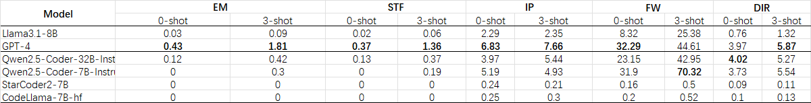
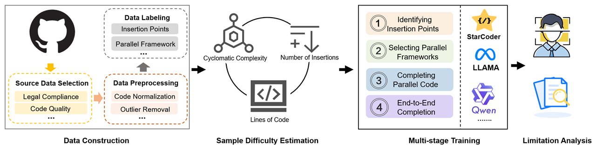

# Evaluating and Improving Framework-Based Parallel Code Completion with Large Language Models

This repository contains the dataset, models, and evaluation scripts for our paper.

## 🧩 Overview

With the growing complexity of modern computing workloads, **parallel programming** has become essential for exploiting the performance potential of multicore CPUs, GPUs, and distributed clusters.  
However, **a vast amount of legacy code in scientific and engineering domains remains serial**, failing to utilize available parallel hardware.

To address this gap, developers increasingly face the need to **transform sequential functions into parallel code**, often using multiple frameworks simultaneously — such as combining **OpenMP**, **MPI**, and **CUDA** within a single application.

To better understand this real-world demand, we analyzed open-source HPC repositories on GitHub:

**Key finding:**

- **59.6%** of repositories combine two or more parallel frameworks (e.g., OpenMP + MPI + CUDA).
- Only **40.4%** of repositories use a single framework.

This shows that real-world HPC development frequently involves **multi-framework integration**, tailored to meet diverse performance goals and heterogeneous hardware constraints.

### 🔍 We Introduce: Framework-Based Parallel Code Completion (FPCC)

Despite the increasing demand for automatic parallelization, **existing datasets and methods** overwhelmingly focus on narrow, single-framework settings.  
This significantly limits their **practical relevance** in assisting real-world development workflows.

To bridge this gap, we propose **Framework-Based Parallel Code Completion (FPCC)** — a realistic code generation task that requires large language models to:

1. 🧠 **Identify insertion points** for parallel directives in serial code,  
2. ⚙️ **Select the appropriate parallel framework** (e.g., OpenMP, MPI, CUDA),  
3. 🧾 **Generate complete and correct directive statements**, including proper clause usage.

FPCC moves beyond basic API generation tasks and frames parallelization as a **structured transformation problem** — requiring **multi-step reasoning over program structure, control flow, and data dependencies**.

By aligning evaluation with real-world code transformation needs, FPCC offers a principled benchmark for building next-generation intelligent assistants for parallel programming.

## 📊 Evaluating FPCC with LLMs

We conduct a systematic empirical study to evaluate the performance of large language models (LLMs) on the FPCC task.

Our evaluation covers:
- ⚙️ Zero-shot prompting using popular open-source and closed-source LLMs
- 🧪 Multi-stage fine-tuning under task decomposition
- 📈 Metrics including line-level F1, framework accuracy, and CodeBLEU

To support reproducibility, we provide our **prompt templates** used for zero-shot and 3-shot evaluation in `data/prompt/`:

  

## 🧪 Method Overview

Our approach consists of a structured pipeline to build and evaluate a realistic benchmark for multi-framework parallel code completion.

  

- 🔍 **Data Construction**: We extract and normalize parallel code from GitHub, ensuring license compliance and quality. Each sample is labeled with insertion points and target frameworks (OpenMP, MPI, CUDA, etc).
- 📊 **Sample Difficulty Estimation**: We assess instance complexity (e.g., cyclomatic complexity, loop depth) to support curriculum learning.
- 🧠 **Multi-Stage Training**: We decompose the FPCC task into four sub-tasks and train LLMs accordingly.
- 🔍 **Limitation Analysis**: We analyze typical model failure cases to inform future improvements.

